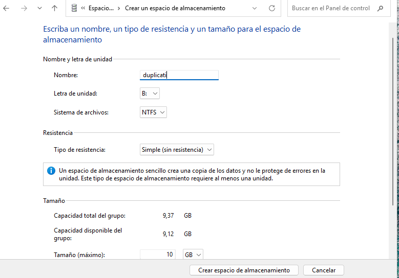
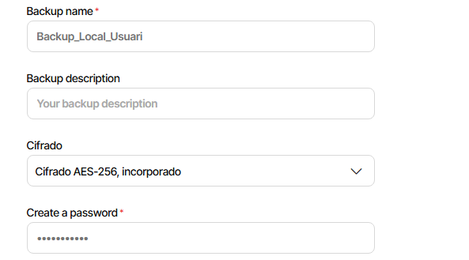
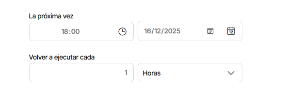

# Guia pas a pas – Còpies de seguretat Windows amb Duplicati (3-2-1)

## PAS 1. Crear la màquina virtual
1. Crear una **màquina virtual Windows 11**.
2. Assignar:
   - **Disc 0**: per al sistema operatiu.
   - **Disc 1**: disc secundari de **10 GB**.
     
  

3. Instal·lar Windows 11 de manera normal.
4. Crear un usuari local (simular l’usuari director).

## PAS 2. Preparar el disc secundari
1. Iniciar sessió a Windows.
2. `Win + X` → **Administració de discs**.
3. Inicialitzar el disc (GPT).
4. Crear volum simple, lletra **D:**, format **NTFS**.

  
  

5. Crear carpeta:
```text
D:\Backups\Duplicati
```
  

## PAS 3. Crear compte Google Drive
1. Crear un compte Google nou (no escolar).
2. Accedir a Google Drive i verificar funcionament.

## PAS 4. Instal·lar Duplicati
1. Descarregar Duplicati per Windows.
2. Executar l’instal·lador.
3. Acceptar opcions per defecte.
4. Obrir la interfície web:
```text
http://localhost:8200
```

## PAS 5. Còpia local al disc secundari
### Configuració
- Nom: `Backup_Local_Perfil`
- Xifrat: **AES-256**
  
  
  
- Destí: Carpeta local  
```text
D:\Backups\Duplicati\PerfilUsuari
```
- Origen:
```text
C:\Users\NomUsuari
```
  

- Planificació: **cada 1 hora**
  
  

## PAS 6. Còpia al cloud (Google Drive)
### Configuració
- Nom: `Backup_Cloud_GoogleDrive`
  
    

- Destí: Google Drive
- Carpeta remota:
```text
Duplicati/PerfilUsuari
```
- Planificació: **cada dia a les 18:00**
- Xifrat activat

## PAS 7. Proves
1. Crear fitxers a **Documents**.
2. Esperar execució automàtica.
3. Verificar còpia local i al cloud.

## PAS 8. Simular pèrdua
1. Esborrar tot el contingut de:
```text
Documents
```

## PAS 9. Restaurar des del disc local
1. Seleccionar `Backup_Local_Perfil`.
2. Restaurar carpeta **Documents**.
3. Verificar recuperació.

## PAS 10. Restaurar des del cloud
1. Seleccionar `Backup_Cloud_GoogleDrive`.
2. Restaurar versió desitjada.
3. Verificar integritat.

## PAS 11. Resultat
- ✔ Còpia local cada hora
- ✔ Còpia cloud diària
- ✔ Restauració correcta
- ✔ Compliment esquema **3-2-1**
