# T05: Accés Remot. Connexió via SSH 

## Configuració de ssh

- Primer de tot instal·lem SSH
```bash
sudo apt install ssh -y
```
- Un cop instal·lat a l'arxiu `/etc/ssh/sshd_config` afegim una nova línia per poder indicar quins usuaris poden accedir al ssh.
  Indicarem que només *usuari* pot accedir
  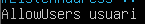
  Creem un usuari secundari anomenat *usuari2* i afegim un password a *root*
  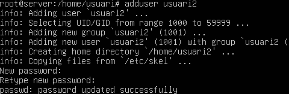
  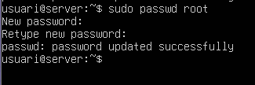
  

- Comprovem que es pot connectar remotament a *usuari* però no a *usuari2*
  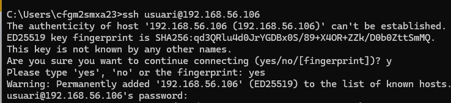
  
  

- Configurem amb redirecció dinàmica al client per redirigir el trànsit.
  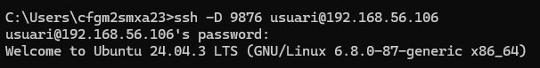

- Configurem el proxy al client i amb WireShark capturem paquets per comprovar la connexió Client-Servidor
  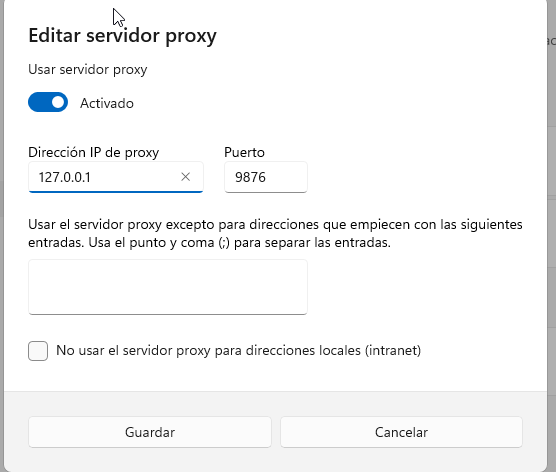
  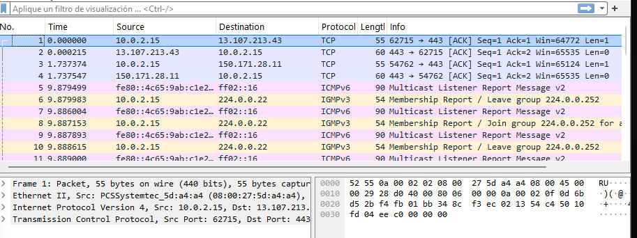

- Generem una clau pública
  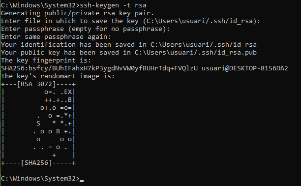
  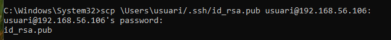
  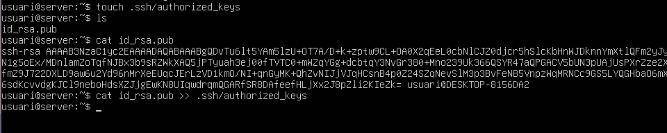

- Comprovem que ens demana la clau pública per accedir
  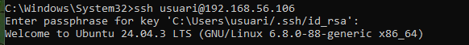

- Instal·lem Servidor OpenSSH a Windows11
  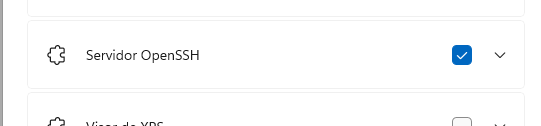

- Iniciem el servei i indiquem que inici automaticament
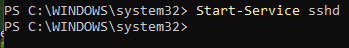
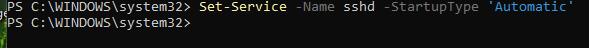
