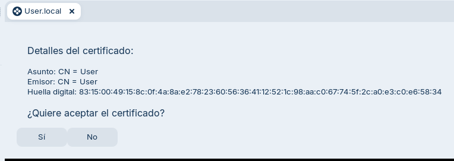
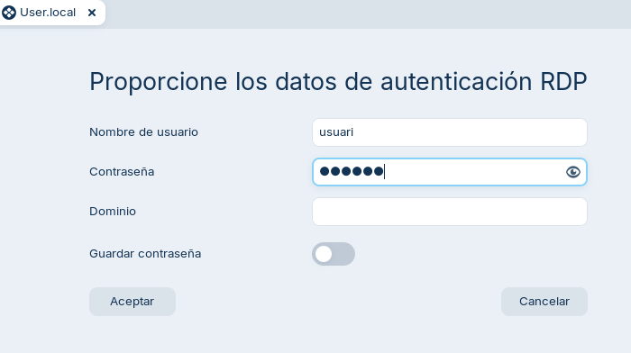
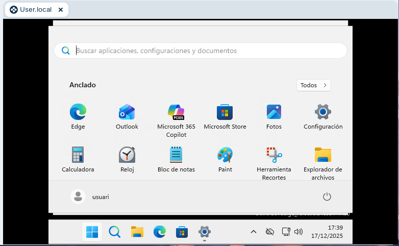
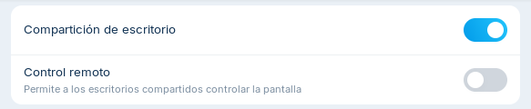
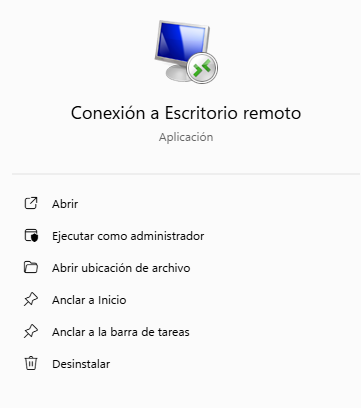
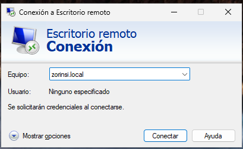
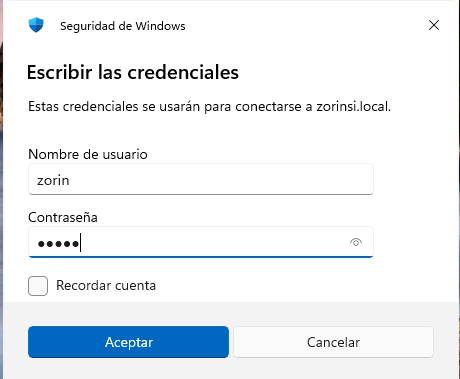
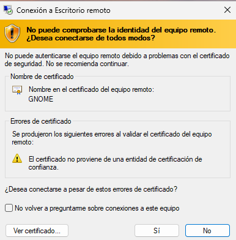
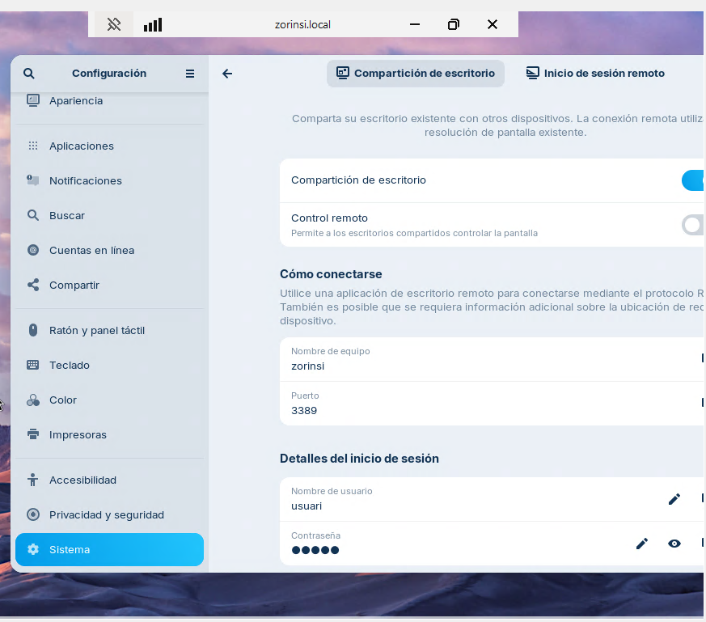

# T06: Accés remot. Escriptori remot (RDP)

## Escriptori remot Windows

- Primer de tot activem l'opció d'escriptori remot
  
  

  
- Afegim els usuaris permesos
  
  

- A **Zorin** anem a l'app Remmina i ens connectem a l'equip Windows `User.local`
  
  

- Afegim els credencials de Windows

  

- Ja estem connectats a Windows!
  
  

---

## Escriptori remot Linux

- A **Zorin** anem a **Configuració** &rarr; **Sistema** &rarr; **Escritorio remoto**

  
  

- A **Windows** busquem l'app `Conexión a escritorio remoto`
  
  

- Escrivim el nom de l'equip

    

- Afegim credencials
    
    

- Ja estem connectats a Zorin!
    

  
