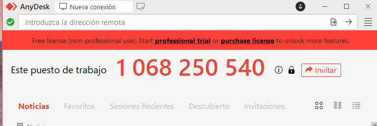

# Guia Ràpida d’Assistència Remota per a Clients d’EverPia

Aquesta guia està pensada per a usuaris finals. L’objectiu és que pugueu rebre ajuda del nostre equip tècnic de manera **ràpida i senzilla**, sense coneixements tècnics.

---

## 1. Descarregar el mòdul de suport

1. Accediu a l’enllaç proporcionat pel tècnic per descarregar **AnyDesk Quick Support**:  
   [Descarrega AnyDesk Quick Support](https://anydesk.com/en/downloads)  
2. No cal instal·lar res: només obriu el fitxer descarregat.  

---

## 2. Obtenir el vostre ID i contrasenya

1. Quan obriu l’aplicació Quick Support, veureu una finestra amb un **ID numèric**.  
2. També pot aparèixer una **contrasenya temporal** si cal.  

3. Comuniqueu aquest ID al tècnic d’EverPia:  
   - ID: `XXXXX`  

---

## 3. Acceptar la connexió

1. Quan el tècnic intente connectar-se, apareixerà un **avís de connexió** a la pantalla.  
2. Feu clic a **Acceptar** per permetre la connexió.  
3. A partir d’aquí, el tècnic podrà veure i controlar la vostra pantalla per solucionar l’incidència.  

---

## 4. Bones pràctiques durant la sessió

- No compartiu les vostres contrasenyes amb tercers.  
- El tècnic només accedirà a la vostra pantalla durant la sessió.  
- Un cop resolta la incidència, el tècnic tancarà la connexió.  

---

## 5. Tancar la sessió

1. Quan finalitzi la sessió, tanqueu l’aplicació Quick Support.  
2. Ja no hi ha cap connexió activa amb EverPia.  

---

**Nota:** Aquesta guia ha estat dissenyada per ser **molt visual i simple**; si teniu qualsevol dubte, contacteu directament amb el vostre tècnic EverPia.
