# T09: Servidor fitxers Linux. NFS


##  Fase 1: Preparació de l'entorn

- Un adaptador en NAT i l'altre en Host-Only
- Instal·lem nfs

```bash
sudo apt install nfs-kernel-server
```


## Fase 2: Preparació del servidor

- Creació de Grups: Crear dos grups per al client: devs i admins.


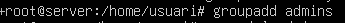

- Creació d'Usuaris: Crear un usuari dev01 (membre del grup devs).


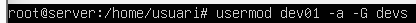

- Crear un usuari admin01 (membre del grup admins). Creació de Directoris (al Servidor):


- Crear el directori per als projectes de desenvolupament: /srv/nfs/dev_projects

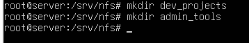

- Crear el directori per a les eines d'administració: /srv/nfs/admin_tools
  


- Permisos del Servidor (El punt clau):

  Es vol que els developers tinguin control total sobre els seus projectes, i que  admins tinguin control total sobre les      seves eines. En tots dos casos el propietari sera `root`

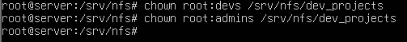


  
- Com a pas final, s'instal·laran els paquets necessaris per al servei NFS al servidor i es configurarà l'exportació dels directoris amb les opcions adequades.

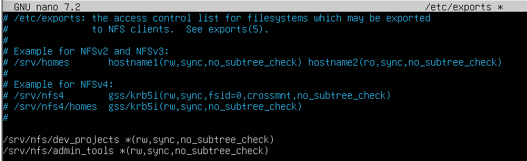

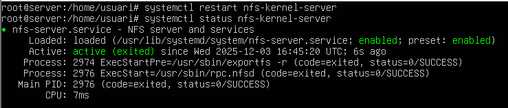


## Fase 3: L'Exportació d'Administració (El Dilema del root_squash)

Problema:
Root del client no pot escriure al directori NFS perquè s’aplica root_squash, que redueix els privilegis per seguretat.

Solució:
Afegir l’opció no_root_squash a l’exportació NFS. Això permet que root del client mantingui privilegis i pugui crear fitxers com a root.


## Fase 4: L'Exportació de Desenvolupament (Permisos rw vs ro)
Abans de tot intal·lem el servei nfs
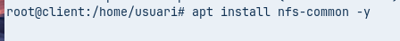
Crearem els grups i usuaris amb els mateixos UID i GID que el server

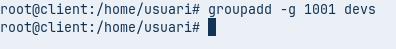


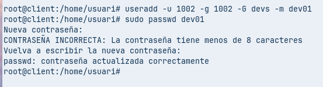

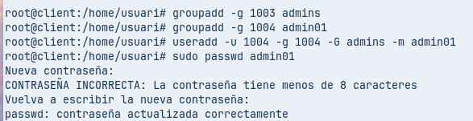

Objectiu:
Configurar /etc/exports amb dues exportacions del mateix directori:

Xarxa d’administració (192.168.56.0/24) → escriptura.

Xarxa de consultors (192.168.56.100) → només lectura.

Proves:

Muntar a /mnt/dev_projects i escriure com dev01 → ha de funcionar.

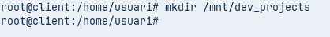

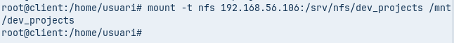

Canviar IP a 192.168.56.100, provar d’escriure → només lectura.

Canviar usuari a admin01, provar d’escriure → falla (no és al grup devs).


## Fase 5: Muntatge Automàtic amb /etc/fstab

Objectiu:
Configurar el client perquè munti automàticament els recursos NFS a /mnt/admin_tools i /mnt/dev_projects en iniciar el sistema.
Passos:

Editar /etc/fstab i afegir les entrades NFS corresponents.

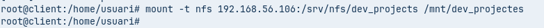

Executar mount -a per provar sense reiniciar.

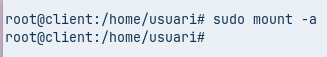
